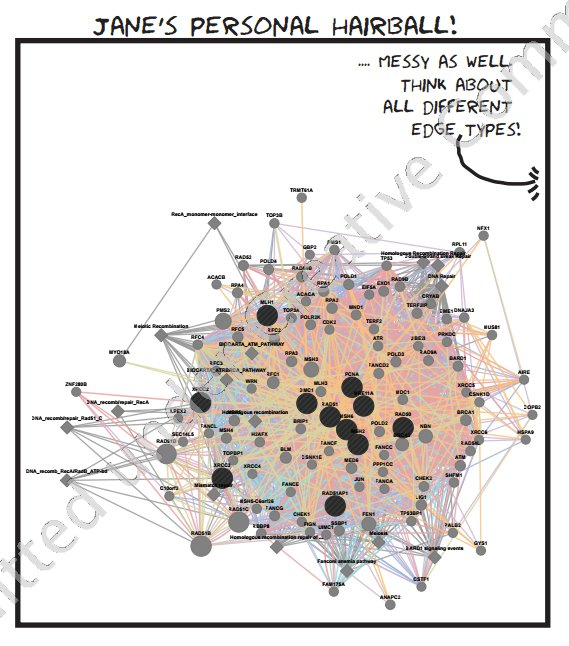
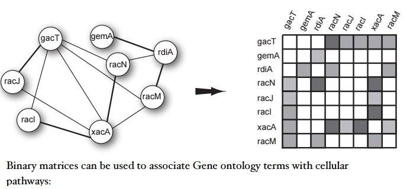
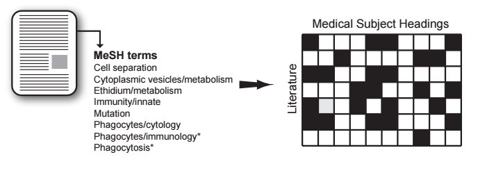
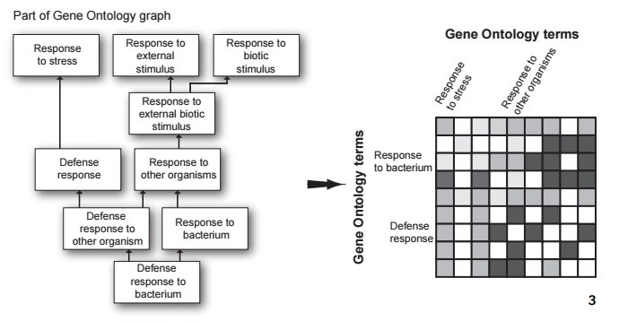
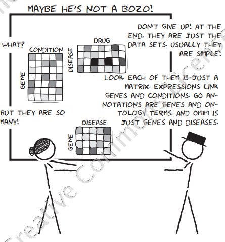
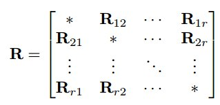
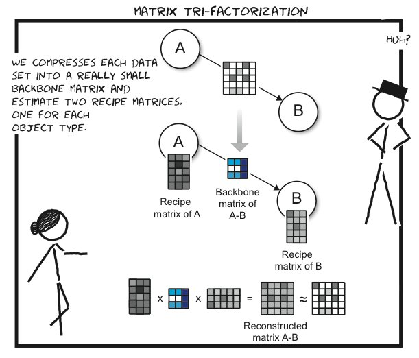
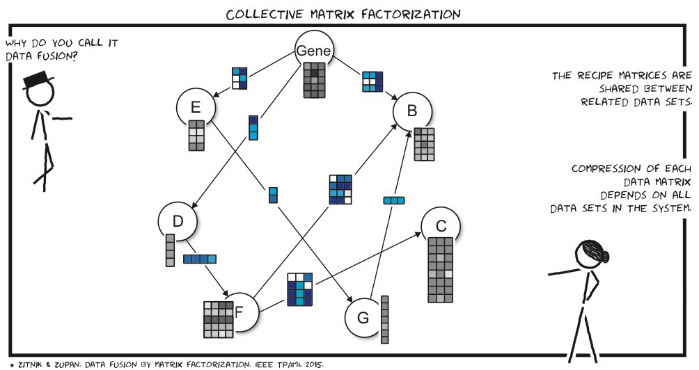
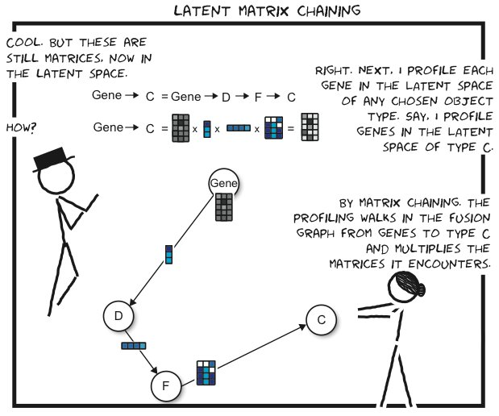
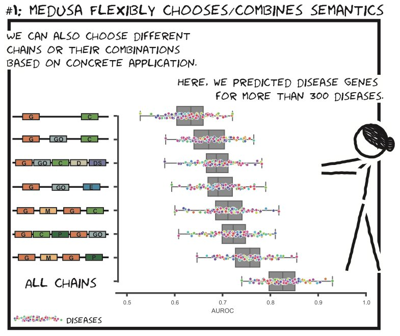

# Jumping across biomedical contexts using compressive data fusion

## by Marina Zitnik Blaz Zupan

### 2016 ISMB論文読み会

 発表者 国立癌センター 宮本 丈 

---

# 3行で

* 多様なソースからのデータを組み合わせて自分に興味のある情報を抽出する手法
* 理論的な厳密さよりも、有用性を強調
* 邪悪さが一切ない(データ弱者のための手法)

※ ソフトウェア名は[Medusa](https://github.com/marinkaz/medusa)

---

# motivation

特定の形質`A`と優位に相関する遺伝子`B`を見つけたい.

↓ 一般化

特定の型`<A>`のインスタンス`\(a_1, a_2, ... a_n\)`と優位に相関する

型`<B>`のインスタンス`\(b_1, b_2, ... b_n\)`を見つけたい

---

# How ?
## 様々なソースからのデータ群を組み合わせる。

* GO
* KEGG
* MESH
* PUBMED
* GEO
* PUBCHEM

etc ...

---

# How ?
## 質、量ともにカオスに

→ まずはすっきりさせるところから

---

# 全体の流れ

1. 全部行列に直す(前処理)
2. 関連付ける
3. collective matrix factorization(ここまで先行研究)
4. Medusa

---

# 全体の流れ

1. 全部行列に直す(前処理)
2. 関連付ける
3. collective matrix factorization(ここまで先行研究)
4. Medusa

---

# 1. 行列に直す

### グラフデータ

---

# 1. 行列に直す

### xml

---

# 1. 行列に直す

### GO

---

# 全体の流れ

1. 全部行列に直す(前処理)
2. 関連付ける
3. collective matrix factorization(ここまで先行研究)
4. Medusa

---

# 2. 関連付ける

間接的なデータしかなくとも情報を用いることができる。

---

# 2. 関連付ける

行列の行列として表現できる。

ここで、同じ型同士の行列(図の対角成分`\(\Theta \in T\)`)はクラスタリングの際の正則条件として用いる(後述)

---

# 2. 関連付ける

同じもののグラフ表現

---

# 2. 関連付ける

グラフを`\(G\)`とすると

`\(G = (V, R, T)\)`、ただし

* `\(V\)`は頂点(型)
* `\(R\)`は辺(Relation matrix)
* `\(T\)`は同じ型のオブジェクト間の行列(制限行列) `\(\Theta \in T\)`

---

# 全体の流れ

1. 全部行列に直す(前処理)
2. 関連付ける
3. collective matrix factorization(ここまで先行研究)
4. Medusa

---

# collective matrix factorization

`$$ \sum_{R{ij} \in R} {|| R_{ij} - G_iS_{ij}G_j^{T} ||^2} + \sum_{\Theta \in T^l}{tr((G^l)^T\Theta^lG^l)} $$`

を最小化するような`\(G_i, G_j,S_{ij}\)`を選ぶ。-> **制限付き固有値分解**による低ランク近似

semi-supervised clusteringの一種。「同じ型のオブジェクト同士で、かつ相関のあるオブジェクトは、おそらく同じクラスタに入るはずだ」という事前知識を用いる。

例: SNS上でつながリの深い人物どうしならば、同じ映画を選好するクラスタに入りやすいはずだ。

クラスタ数は自動推定できないようになっているが、これがちょっと扱いを難しくしている印象

---

# matrix tri-factorization
#### 潜在空間にマッピング(クラスタリング)

`\(R\)`→`\(GSG^T\)`

---

# collective matrix factorization
#### ラグランジュ乗数法によってG,Sを求める

---

# collective matrix factorization
### 解き方

分解後のそれぞれの行列のランクkをあらかじめあたえておく。`\(k_1, k_2 ... k_r\)`

先ほどの数式(最小化したい目標関数)を`\(J = (G;S)\)`とし、

未定乗数`\(\lambda\)`を導入し、ラグランジュ関数`\(L = J(G;S) - \sum^r_{i=1}tr(\lambda_iG^T_i)\)`を定義する。適当な初期値から

1. `\(G_1 ... G_r\)`　を固定して`\(\partial f / \partial S_{ij} = 0\)`を解き、`\(S\)`を求める.

2． `\(S\)`を固定して`\(\partial f / \partial G_i = 0\)`をそれぞれのiについて求める。(ただし、iは[1 ... r])

を適当な閾値以下になるまで繰り返す。

---
# collective matrix factorizaton

#### 問題点

分解後の行列のランクk(= クラスタ数)をどう決める?

ここでは`\(k = k_1, ... k_r \)`の全てについて上限と下限を設定し、

1. 前頁のアルゴリズムで分解を実行
2. cophenetic correlation coefficient `\(\rho\)` を計算し、モデルのバリアンスを評価
3. 2分探索で適切なkを一つずつ決める。

あまり洗練されていない印象。改良の余地あり?

---

## 分解後

#### 行列をチェインさせて任意の2種類のデータの関係を見る

オブジェクトどうしの、本来ならば自明でない関係性が見れてハッピー

ここでのチェイン後の行列をCとする

---

# 全体の流れ

1. 全部行列に直す(前処理)
2. 関連付ける
3. collective matrix factorization(ここまで先行研究)
4. Medusa

---

複数のチェインを統合して検出力を上げたい

↓ 問題は

2頂点間に複数のチェインがあった場合、それらを統合して考えるのはナンセンス。

↓ なぜかというと

それぞれのチェインはそれぞれ違った基準での距離を表しているため

↓ 解決策

Pivot Object(ポジコン)を用いて、似ているオブジェクトの組を見つける

> つまり ... 病気Aと関連があるとわかっている遺伝子`\(b_1, b_2, ... b_n\)`

> から新たな関連遺伝子群`\(b_{n+1}... b_{m}\)`を検出する。

---

# Medusa

1. pivot `\(b_1, ..., b_n\)`とCが近いBのオブジェクトを探す
2. topのものが閾値以上であった場合pivotに追加
3. pivot に変動がなくなるまで繰り返す。

一見して「距離の定義の仕方」が極めて大事だとわかるが、そこはうまいことやってるらしい(著者曰く)

複数のチェインCを組み合わせる場合

1. Cを行でノーマライズ
2. それぞれのCを線型結合 ...  理論的正当性はない

してから上記のアルゴリズムを実施

---

# ポジコンで検証 -> 検出力向上

---

# 違う型のオブジェクトどうしでもできる

例: 病気Aと関連のある遺伝子群を持っていて、それに似た病気のリストをひっぱってきたい

※: 自分の興味のある基準でひっぱってこれるのがミソ(多分)

詳しくは論文を

---

# なぜISMBに通ったか

* 使えそう(需要が多そう)だから
* 関数型言語みたいで美しいから
* 今までの集大成感があるから

---

# refs

http://helikoid.si/A8BFDCC6-8297-40AE-A9B4-59AA6983BF33/FinalDownload/DownloadId-FD86820B5866BD37D790F1FF903773BF/A8BFDCC6-8297-40AE-A9B4-59AA6983BF33/bc215/bc2-handouts.pdf

http://eprints.fri.uni-lj.si/2862/1/2014-ZitnikZupan-IEEE-TPAMI.pdf

